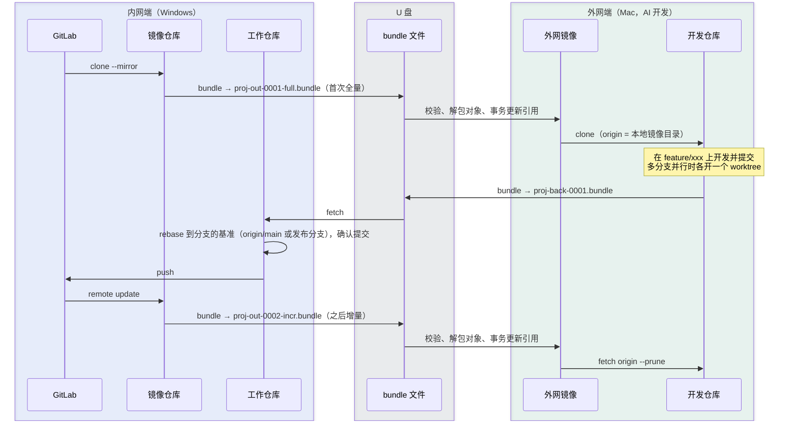

# Git 离线同步（git-offline-sync）

在**只能访问内网 GitLab 的离线机器**与**外网开发机**之间，用 U 盘同步 Git 仓库的桌面工具。
基于 `git clone --mirror` + `git bundle`，Windows 与 macOS 通用（Tauri 2 + React）。


```mermaid
sequenceDiagram
    box rgba(0,82,255,0.08) 内网端（Windows）
        participant GL as GitLab
        participant MR as 镜像仓库
        participant WK as 工作仓库
    end
    box rgba(100,116,139,0.10) U 盘
        participant USB as bundle 文件
    end
    box rgba(15,157,107,0.08) 外网端（Mac，AI 开发）
        participant XM as 外网镜像
        participant DEV as 开发仓库
    end

    GL->>MR: clone --mirror
    MR->>USB: bundle → proj-out-0001-full.bundle（首次全量）
    USB->>XM: 校验、解包对象、事务更新引用
    XM->>DEV: clone（origin = 本地镜像目录）
    Note over DEV: 在 feature/xxx 上开发并提交<br/>多分支并行时各开一个 worktree
    DEV->>USB: bundle → proj-back-0001.bundle
    USB->>WK: fetch
    WK->>WK: rebase 到分支的基准（origin/main 或发布分支），确认提交
    WK->>GL: push
    GL->>MR: remote update
    MR->>USB: bundle → proj-out-0002-incr.bundle（之后增量）
    USB->>XM: 校验、解包对象、事务更新引用
    XM->>DEV: fetch origin --prune
```

外网端是**两层**：包只导入到*外网镜像*（裸仓库），开发仓库从镜像 clone、把它当 `origin`。
这样 `origin` 始终是一个活着的本地远端，`git fetch origin <任意分支>`、`git worktree add`
都能正常用；导入也不再碰开发仓库，不会和正在跑的 AI agent 抢工作区。
一份镜像可以供多个开发仓库共用。

## 功能

| 内网端 | 外网端 |
|---|---|
| 克隆镜像（`clone --mirror`） | 首次用全量包建立外网镜像，之后从镜像克隆开发仓库 |
| 导出全量 / 增量包（自动 fetch、verify） | 按序号导入增量包，跳号或重复导入会被拦截 |
| 导入回传 bundle，或用 `git am --3way` 应用 patch | 基于主线或发布分支新建分支，可建成独立 worktree |
| rebase 到分支的基准，列出提交确认后推送 | 回传：bundle（只含内网没有的提交）或 patch |
| 冲突时提供“继续 / 中止” | 冲突时提供“继续 / 中止”，认得冲突在哪个 worktree |

所有 git 命令及其输出实时显示在底部的“命令日志”中。日志、错误提示和仓库远程地址展示会隐藏 URL 中的用户名、密码及常见令牌查询参数；执行 Git 时仍使用原始地址。脱敏不是任意秘密检测，分享日志前仍需检查提交信息和路径等内容。

长任务可点击“请求停止”。界面会等待原操作返回，不会立即解除忙碌状态；每条 Git 命令默认最多运行 30 分钟。停止或超时不等于回滚，已经完成的 fetch、文件写入或远程推送可能仍然生效，仓库也可能保留未完成的 rebase/am。操作结束后请刷新状态，按提示继续或中止冲突。

## 主线分支与发布分支

配置档里填写**主线分支**（如 `main`）和**发布分支**（如 `release/1.2, release/1.3`，手动填写，可以有多个，两端要一致）。约定：

| 分支前缀 | 基准分支 |
|---|---|
| `feature/`、`bugfix/` | 主线分支 |
| `hotfix/` | 某个发布分支 |

- 每个分支的基准记录在仓库配置 `branch.<分支>.syncBase` 中：外网新建分支时写入，回传包的 manifest 带上（`refs[].base`），内网导入时写回工作仓库。rebase、领先/落后、提交列表、patch 导出范围都按这个基准计算。
- 没有记录的分支（手工创建的、旧版本导出的包）按前缀推断：`hotfix/` 在发布分支中选分叉点最近的一个，其他前缀用主线。分支表里会标出“推断”，rebase 一次后记录下来。
- 前缀和基准不匹配（如从 `main` 拉 `hotfix/x`）只显示警告，不阻止操作。
- 在内网“Rebase 并推送”里可以改基准：用 `git rebase --onto origin/<新基准> origin/<旧基准>`，只搬运分支自己的提交。基准记录在 rebase 成功后才更新；冲突期间保留原记录，“继续”完成后确认新基准，“中止”不改变旧基准（包括原本未设置的情况）。
- rebase 的恢复记录保存在实际工作树 Git 目录下的 `offline-sync-rebase.json`，linked worktree 各自独立；应用重新执行 rebase、继续或中止时会核对该记录。不要删除恢复记录来跳过未完成的操作。
- 仓库身份（根提交）和增量导出基线仍然只看主线分支。

## 安全措施

- **禁止在镜像仓库中推送**：`--mirror` 仓库一推送就会覆盖、删除远程分支。推送只能在工作仓库中进行。
- 外网开发仓库的 push 地址被设成一个无效占位符（`git remote set-url --push origin …`），
  免得有人把本地分支推进外网镜像、污染那份只读副本。
- 每个包旁边有一个 `*.manifest.json`，记录仓库身份（根提交）、序号和导出时的分支、tag 快照：
  - 导入前核对格式、文件名、引用、对象及仓库身份，防止导错项目或导入不一致的包；
  - 增量包序号必须连续；
  - 外网镜像导入时先校验和解包对象，再用带旧值检查的引用事务同步分支与 tag，包括新增、回退和删除；
    开发仓库靠 fetch 跟上，不重复做这套校正。
- 只有引用变化、没有新对象时，导出会使用现有全量包格式传递快照，代价是包体积可能变大。旧状态没有引用快照时也保守生成全量包；没有提交或引用变化时不增加序号。
- manifest 校验不是数字签名认证，不能防止攻击者同时修改包与描述文件；只导入可信来源的文件。
- 回传包序号由外网镜像统一分配，多个开发仓库、多个 worktree 同时导出也不会撞号。
- 增量基线记录全部分支和 tag，不只是 `main`，其他分支的更新也不会漏。
- 只打包 `refs/heads` 和 `refs/tags`，不会带上 GitLab 镜像里的 `refs/merge-requests` 等引用。
- 回传分支如果与内网本地分支已经分叉（比如内网 rebase 过），会导入成 `<分支>-import-<序号>`，不会覆盖本地分支。
- 工作区有未提交修改，或仓库里有未完成的 rebase/am 时，会拒绝执行 rebase 和导入 patch。

## 常见问题

### 从 1.0.x 升级：外网端要重新导入一次

1.0.x 的外网仓库是直接 `git clone <bundle>` 出来的，`remote.origin.url` 指向 U 盘上
首次那个全量包，之后再也不更新。按 ref 名 fetch 就会失败：

```
fatal: couldn't find remote ref refs/heads/hotfix/628108
```

新版本不兼容这种仓库，也不做迁移。升级后：

1. 如果旧仓库里有还没回传的提交，**先导出回传包**；
2. 在配置里填「外网镜像目录」和「开发仓库目录」（两个不同的目录）；
3. 内网端重新导出一个全量包，外网端导入 → 建立镜像 → 从镜像克隆开发仓库；
4. 旧的开发仓库目录可以删掉。

把包导进一个已存在的旧仓库目录会被明确拒绝（“不是外网镜像”），不会把它改坏。

### macOS / Windows 上导入报 `cannot lock ref ... .lock': File exists`

典型报错：

```
git update-ref --stdin
fatal: cannot lock ref 'refs/heads/ct_main_fr47363': Unable to create
'.../mirror.git/refs/heads/ct_main_fr47363.lock': File exists.
```

（导入发生在外网镜像里，所以报错路径是镜像目录；开发仓库从镜像 fetch 时也会遇到同样的问题。）

如果没有其他 git 进程在运行，原因通常是上游有**只差大小写的分支**，例如 `CT_MAIN_FR47363` 和 `ct_main_fr47363`。GitLab 服务器（Linux）区分大小写，这两个分支可以共存。macOS（APFS）和 Windows（NTFS）默认不区分大小写，而 git 默认的 `files` 格式把每个 ref 存成一个文件，两个分支会被当成同一个文件。导入时两者在同一个 `update-ref` 事务里加锁，第二个锁文件就会报 "File exists"。即使没有报错，两个分支也可能互相覆盖、读到错误的提交。重试无法解决。

检查是否存在这种分支（有输出即说明存在）：

```sh
git for-each-ref --format='%(refname)' | tr 'A-Z' 'a-z' | sort | uniq -d
```

**解决方法：把仓库的 ref 存储格式迁移为 reftable。** reftable 不用文件名存 ref，不受文件系统大小写影响。迁移命令 `git refs migrate` 需要 git 2.46 及以上版本（`git --version` 查看）：

外网镜像和开发仓库都要迁移（镜像是导入的落点，开发仓库会从它 fetch 到同名的远程跟踪分支）：

```sh
cd <外网镜像>                     # 裸仓库，下面的 .git 换成 .
cp -R . ../mirror-backup         # 先备份
git rev-parse --show-ref-format  # 输出 files 表示需要迁移
git refs migrate --ref-format=reftable
git rev-parse --show-ref-format  # 应输出 reftable

cd <开发仓库>
cp -R .git ../.git-backup
git refs migrate --ref-format=reftable
```

迁移后在本工具里重新导入该包即可。注意：

- reftable 仓库只能用 git 2.45 及以上版本读写，旧版 git 和部分 IDE 内置的 git 可能无法识别。
- 如果要从零开始，可以让开发仓库直接用 reftable 格式克隆：`git clone --ref-format=reftable <镜像目录> <目录>`（git 2.45 及以上）。
- 根本的解决办法是在上游删除或改名其中一个分支。

## 目录结构

```
src-tauri/src/core/     与界面无关的同步核心（可单独测试）
  git.rs                git 执行器：参数数组、实时日志、Windows 不弹黑窗、GIT_TERMINAL_PROMPT=0
  sync.rs               各个同步流程
  repo.rs               仓库状态、分支、提交、同步状态文件
  manifest.rs           包描述文件与结构校验
  storage.rs            状态原子写入、备份、进程间文件锁
src-tauri/src/commands.rs  Tauri 命令（在后台线程执行，日志以 git-log 事件推送）
src-tauri/tests/e2e.rs     端到端测试：本地裸仓库模拟 GitLab，完整往返
src/                    React 界面（全部使用 HeroUI v3 组件）
  index.css             灰阶浅深色主题、HeroUI 语义变量、桌面面板布局
  ui.tsx                基于 HeroUI 的应用级组合组件：StepCard、PathInput、Notice、PackageRow…
  runner.tsx            串行执行 + Toast 提示 + AlertDialog 确认框
```

### 界面约定

- 组件统一使用 HeroUI v3（`@heroui/react`，基于 React Aria，需要 Tailwind CSS v4）。页面只使用 `ui.tsx` 里的组合组件或 HeroUI 原生组件，不写一次性样式。
- 布局参考 [PI-Desktop](https://github.com/vastsa/PI-Desktop)：可收起的配置侧栏、固定顶栏、独立滚动工作区和底部日志面板。侧栏支持按名称或包名前缀搜索配置；流程导航可跳转并聚焦到对应步骤。
- 颜色、圆角、阴影等设计 token 只在 `src/index.css` 的 `:root` 中定义，并映射为 HeroUI 语义变量（`--accent`、`--surface`、`--border` 等），修改主题只需改这一处。
- 正文采用系统字体，路径与提交哈希使用随包分发的 JetBrains Mono，无需联网加载字体。在“设置 → 外观 → 主题”中可选择系统、浅色或深色，保存后生效并在下次启动时恢复；默认跟随系统。用背景明度区分面板，主操作使用黑白反色按钮；彩色仅用于成功、警告和错误等状态。
- 动效只用 CSS 实现，系统开启“减少动态效果”时自动关闭。

### 应用图标

源文件在 `assets/icon/`：`app-icon.svg` 是 macOS 版本，四周留边距并带投影；`app-icon-windows.svg` 是 Windows 版本，铺满画布。修改后重新生成：

```bash
pnpm tauri icon assets/icon/app-icon.svg                              # 全部尺寸 + icns
pnpm tauri icon assets/icon/app-icon-windows.svg -o /tmp/win-icons    # 再覆盖 Windows 相关文件
cp /tmp/win-icons/icon.ico /tmp/win-icons/Square*Logo.png /tmp/win-icons/StoreLogo.png src-tauri/icons/
rm -rf src-tauri/icons/android src-tauri/icons/ios
```

界面里的 logo（`ui.tsx` 中的 `AppGlyph`）和图标用的是同一个图形。

同步状态保存位置：
- 内网：`<内网镜像仓库>/offline-sync/state.json`
- 外网：`<外网镜像仓库>/offline-sync/state.json`，多个开发仓库共享回传序号。

界面配置保存在系统应用配置目录中，路径可在“设置”里查看。配置和同步状态使用同目录临时文件原子替换，已有合法 JSON 会保存为同路径的 `.bak` 文件。读取损坏状态时会报错，不会自动回退备份；恢复前必须核对已导出、已传输的包序号，避免重复使用旧序号。

镜像和传输目录的操作锁放在目录同级的 `.<目录名>.offline-sync.lock` 中，由操作系统在句柄关闭或进程退出时释放。锁文件保留不表示操作仍在运行；不要通过删除锁文件绕过正在运行的同步实例。

导出先写入传输目录中的隐藏暂存目录 `.offline-sync-export-*`。进入发布阶段后，镜像中的 `offline-sync/export-pending.json` 记录目标包和待提交状态，包旁的 `.pending` 标记阻止列表展示及导入半成品。下一次在同一镜像导出时会先完成这份记录并返回原包、原序号；请保留暂存目录、恢复记录及标记，不要手动删除后重新分配序号。

## 开发

需要 Node ≥ 22.13、pnpm 11.5.0、Rust stable 和 Git ≥ 2.25。CI 固定使用 Node 24.19.0 和 Rust 1.98.1；本地建议使用相同版本。

PR 和普通分支推送会在 Windows/macOS 上运行前端测试与构建，以及 Rust 测试、格式检查和 Clippy。`pnpm test` 同时包含离线发布脚本回归；`pnpm check:version` 核对 package、Cargo 和 Tauri 版本，标签构建还要求标签为精确的 `v<版本>`。

```bash
pnpm install
pnpm tauri dev                    # 开发运行
cd src-tauri && cargo test        # 单元测试 + 端到端测试
```

> macOS 上如果还没同意 Xcode 许可，`/usr/bin/git` 会拒绝运行。可以执行 `sudo xcodebuild -license accept`，
> 或者在应用的“设置”里把 git 路径指定为 `/Library/Developer/CommandLineTools/usr/bin/git`。

## 打包

Tauri 不能交叉编译，Windows 包必须在 Windows 上构建：

- **CI**：推送 `v*` 标签后，`.github/workflows/build.yml` 会在 Windows 和 macOS 上分别测试并打包。发布脚本先核对版本、两种 Windows `.exe`、macOS Universal `.dmg`、更新归档、签名格式和 `latest.json`，再上传到 [GitHub Release](https://github.com/laplacesc/git-offline-sync/releases) 草稿，逐个下载核对 SHA-256，全部通过后才公开。失败保留草稿供重试；已公开的同标签 Release 会被拒绝，不会被重置、覆盖或删除。标签包含 `-`（如 `v2.0.2-beta.1`）时标记为预发布。安装包也保留在 Actions 的 Artifacts 中。
- **手动构建**：在 Actions 的 `build` 工作流中运行 `Run workflow`；选择分支时只构建并保存 Artifacts，选择 `v*` 标签时还会发布到对应 Release。
- **Windows 安装包**：`...-with-webview2.exe` 内置 WebView2 离线安装包（装机无需联网，体积大，内网首选）；`...-no-webview2.exe` 不打包 WebView2（体积小，缺运行时时安装程序需联网下载）。
- **本地**：在对应系统上执行 `pnpm tauri build`。

Windows 离线安装说明：
- 已配置 `webviewInstallMode: offlineInstaller`，安装包内含 WebView2，没有 WebView2 的 Win10 也能离线安装。
- 目标机器需要安装 Git for Windows。如果 git 不在 PATH 中，在“设置”里指定 `git.exe` 的路径。
- 未签名的 macOS 包首次打开时，需要右键选择“打开”。
